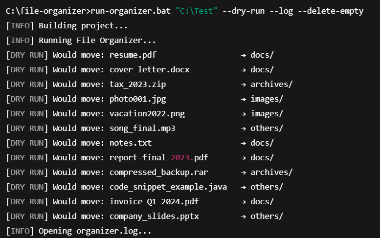

📁 File Organizer CLI
A simple, extensible Java CLI tool to organize files in a folder based on type.
Written in Java 11 with Maven. Includes advanced options like dry run, logging, and empty-folder cleanup.

🚀 Features

✅ Organizes files into folders like images/, docs/, archives/, etc.

✅ Supports --dry-run (no actual changes)

✅ --log writes all actions to organizer.log

✅ --delete-empty removes any empty folders after organizing

✅ Works via command line or .bat launcher on Windows

🛠 Tech Stack
Java 11 (OpenJDK)

Maven

Standard Java NIO (java.nio.file.*)

Windows .bat runner

📦 File Type Rules
Type	Extensions
Images	.jpg, .png
Documents	.txt, .pdf, .docx
Archives	.zip, .rar
Others	All unrecognized extensions

📄 Build Instructions
mvn clean package
Make sure you have Java 11 and Maven installed.

📌 Usage

✅ Basic Command

java -cp target/file-organizer-1.0-SNAPSHOT.jar com.fileorganizer.Main "C:\Path\To\Folder"

✅ With Optional Flags

--dry-run # Show what would happen, but do not move files
--log # Log all actions to organizer.log
--delete-empty # Remove any empty folders after organizing

✅ Example

java -cp target/file-organizer-1.0-SNAPSHOT.jar com.fileorganizer.Main "C:\Downloads" --dry-run --log --delete-empty

🖱 Windows .bat Shortcut

Run this instead for convenience:
fileorganizer.bat "C:\Downloads" --dry-run --log --delete-empty

Auto-builds with Maven and opens the log file if --log is used.

📸 Preview  

🧪 Sample Output

[DRY RUN] Would move: image.png → images/
[DRY RUN] Would move: resume.pdf → docs/
Deleted empty folder: old_notes

📜 License

MIT License. Free to use, share, and modify.

💡 Future Ideas

--extensions=jpg,pdf to target specific types

Configurable rules (JSON or XML)

JavaFX GUI or Spring Boot REST API version